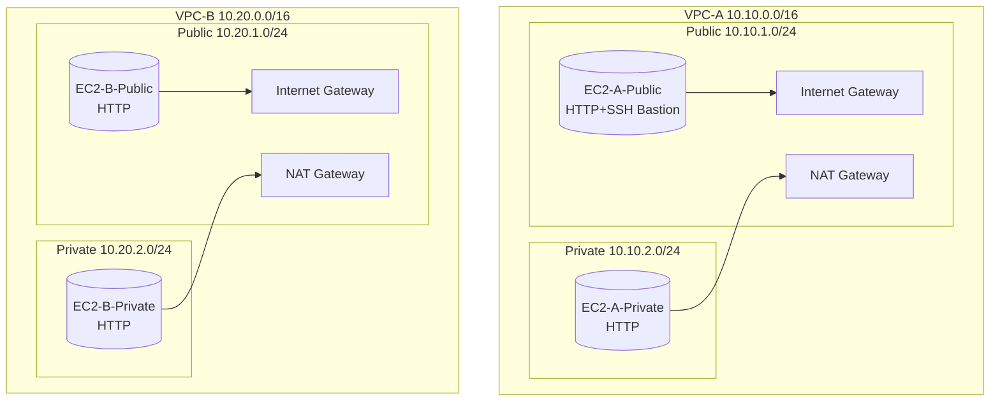

# AWS Networking Lab — Basic VPC Playground (Full)

This lab deploys **two VPCs** (10.10.0.0/16 and 10.20.0.0/16). Each VPC has a **public** and **private** subnet, an **Internet Gateway (IGW)**, a **NAT Gateway**, and EC2 instances so you can test:

- Internet access from public subnets via **IGW**
- Internet egress from private subnets via **NAT Gateway**
- **Bastion SSH** (public → private)
- Ping/SSH **between public ↔ private** instances inside each VPC

> ⚠️ **Costs:** NAT Gateways bill by the hour + data. Keep this lab small, run it briefly, and **delete the stack** when done.

---

## 🗺️ Architecture Diagram



---

## 📦 What gets deployed

- **VPC‑A** `10.10.0.0/16`
  - Public subnet `10.10.1.0/24` (0.0.0.0/0 → IGW)
  - Private subnet `10.10.2.0/24` (0.0.0.0/0 → NAT)
  - `EC2-A-Public` (Amazon Linux 2023) — HTTP + bastion (SSH)
  - `EC2-A-Private` (Amazon Linux 2023) — HTTP only (no public IP)
- **VPC‑B** `10.20.0.0/16`
  - Public subnet `10.20.1.0/24`
  - Private subnet `10.20.2.0/24`
  - `EC2-B-Public` — HTTP
  - `EC2-B-Private` — HTTP
- **Security Groups**
  - Public SG: HTTP(80) from `0.0.0.0/0`, SSH(22) from **your IP**; ICMP from VPC CIDR
  - Private SG: HTTP(80) from VPC CIDR; SSH(22) from **Public SG**; ICMP from VPC CIDR

---

## 🔧 Parameters

- `KeyName` — EC2 key pair name for SSH (create one in EC2 → Key Pairs if needed)
- `YourIpCidr` — your IP in CIDR (e.g., `203.0.113.10/32`) so SSH to public instances is allowed
- `InstanceType` — default `t3.micro` (Free Tier: `t2.micro`/`t3.micro` depending on region)

---

## 🚀 Deploy (Console)

1. **AWS Console → CloudFormation → Create stack → With new resources**.  
2. Upload: `cloudformation/network-basic-vpc.yaml`.  
3. Set parameters (`KeyName`, `YourIpCidr`).  
4. **Create stack** and wait for **CREATE_COMPLETE**.  
5. Open **Outputs**:
   - `APublicIP`, `BPublicIP` for quick testing.

> If you need a key pair: EC2 → **Key Pairs** → **Create key pair** (RSA, `.pem`). Keep it private.

---

## 🧪 Lab Exercises

### A) Internet egress (public)
- Open in browser:  
  - `http://<APublicIP>` → shows **EC2-A-Public** page  
  - `http://<BPublicIP>` → shows **EC2-B-Public** page

### B) NAT egress (private)
1. SSH to **EC2-A-Public**:
   ```bash
   ssh -i /path/to/key.pem ec2-user@<APublicIP>
   ```
2. From there, SSH to **EC2-A-Private** (use private IP from EC2 console):
   ```bash
   ssh ec2-user@10.10.2.10   # or the actual private IP
   curl -I https://aws.amazon.com
   ```
   Expected: HTTP 200/301 headers — traffic egresses via NAT Gateway A.

### C) Ping/SSH within each VPC
- From **EC2-A-Public**:
  ```bash
  ping -c 3 10.10.2.10
  curl http://10.10.2.10
  ```
- From **EC2-B-Public**:
  ```bash
  ping -c 3 10.20.2.10
  curl http://10.20.2.10
  ```

> Useful tools: `sudo dnf install -y traceroute tcpdump iperf3`.

---

## 🧭 Console checkpoints

- **VPC → Route Tables**: public default to IGW; private default to NAT.  
- **EC2 → Instances**: only public instances have public IPv4.  
- **EC2 → Security Groups**: verify rules (SSH/HTTP/ICMP).  
- **VPC → NAT Gateways**: one NAT per VPC, with EIP.  

---

## 🆘 Troubleshooting

- **SSH to private times out** → hop via public instance inside same VPC.  
- **Ping from laptop fails** → ICMP only allowed within VPC CIDR by default.  
- **Private has no internet** → private RT default must point to NAT; NAT in public subnet with EIP; IGW attached to VPC.  
- **HTTP blocked** → check SGs (port 80 allowed from world on public, from VPC CIDR on private).  
- **Delete stuck** → retry after 1–2 min; NAT/EIP release can lag.

---

## 🧹 Cleanup

CloudFormation → select the stack → **Delete**.  
If first attempt fails due to dependencies, wait a minute and retry.

---

## 📁 Repository Layout

```
cloudformation/
  network-basic-vpc.yaml
docs/
  architecture.md
.github/workflows/
  cfn-validate.yml
README.md
LICENSE
.gitignore
```
