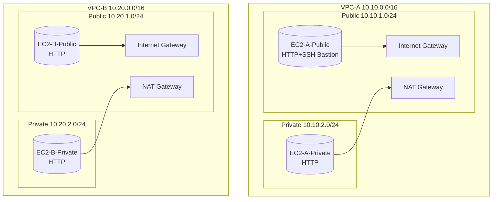

# Architecture

```mermaid
flowchart TB
  subgraph VPCA["VPC-A 10.10.0.0/16"]
    subgraph A-PUB["Public 10.10.1.0/24"]
      AIGW[Internet Gateway]
      ANAT[NAT Gateway]
      AWEBP[(EC2-A-Public<br/>HTTP+SSH Bastion)]
    end
    subgraph A-PRI["Private 10.10.2.0/24"]
      AWEBI[(EC2-A-Private<br/>HTTP)]
    end
  end

  subgraph VPCB["VPC-B 10.20.0.0/16"]
    subgraph B-PUB["Public 10.20.1.0/24"]
      BIGW[Internet Gateway]
      BNAT[NAT Gateway]
      BWEBP[(EC2-B-Public<br/>HTTP)]
    end
    subgraph B-PRI["Private 10.20.2.0/24"]
      BWEBI[(EC2-B-Private<br/>HTTP)]
    end
  end

  AWEBP --> AIGW
  AWEBI --> ANAT
  BWEBP --> BIGW
  BWEBI --> BNAT
```
